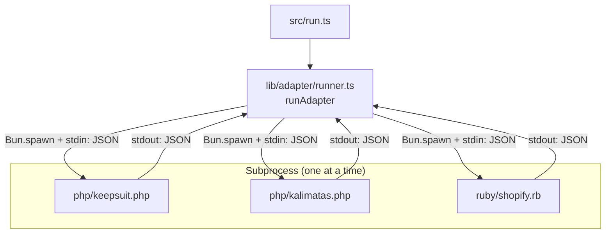

# Adapters

Language-specific adapters that execute Liquid template benchmarks via subprocess.

## Architecture



## Design Decisions

### Why Subprocess?

Each adapter runs as a separate process to:
- Isolate language runtimes (PHP, Ruby)
- Enable accurate memory measurement per-process
- Prevent cross-contamination between benchmark runs
- Allow language-specific optimizations (OPcache, YJIT)

### Why JSON over stdin/stdout?

- Language-agnostic protocol
- Schema-validated input/output
- Simple debugging (pipe JSON manually)
- No inter-process communication complexity

### Phase Separation (parse vs render)

Benchmarks measure parse and render phases separately because:
- Real applications often cache parsed templates
- Performance characteristics differ (parse: CPU-bound, render: data-dependent)
- Enables identifying bottlenecks in each phase

## Protocol

### Input (stdin)

```json
{
  "template": "{{ user.name }}",
  "data": { "user": { "name": "Alice" } },
  "iterations": 100,
  "warmup": 10
}
```

### Output (stdout)

```json
{
  "library": "keepsuit/liquid",
  "version": "0.15.0",
  "lang": "php",
  "runtime_version": "8.3.0",
  "timings": {
    "parse_ms": [0.12, 0.11, ...],
    "render_ms": [0.05, 0.04, ...]
  }
}
```

## Adding a New Adapter

1. Create `{lang}/{name}.{ext}` (e.g., `js/liquidjs.js`)
2. Require the bootstrap file for common utilities
3. Implement parse/render using the library's API
4. Register in `src/lib/adapter/index.ts`

Bootstrap provides:
- `readInput()` / `read_input` - stdin JSON parsing with validation
- `writeOutput()` / `write_output` - stdout JSON output
- `measureTime()` / `measure_time` - high-resolution timing
- `runBenchmark()` / `run_benchmark` - warmup + iteration loop
